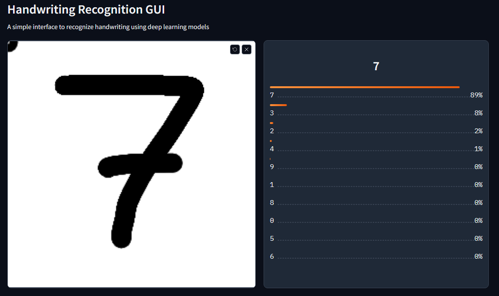

# Hand-Written Recognition GUI

A simple GUI to test models for hand-written digits and characters recognition.


## Installation
Clone the repo and install necessary dependencies (tested in Python 3.9):
```
git clone https://github.com/Pikurrot/hand-write-gui.git
pip install -r requirements.txt
```

## Usage
The intention is that the user defines its own model architecture, and after training, the GUI serves as a simple and elegant to test it, along with other previously trained models.
### Train a model
There is a model architecture defined by default in `modules/model.py`. The user can then replace it with its own architecture.
- Run `python3 train.py` if you are in **Linux / MacOS** or `python train.py` if in **Windows**.
- The training data will be downloaded to `data` and a model will be trained. This process may take a while.
- After the training has finished, the model will be saved in `models` as `model_0.safetensors`.

### Run the GUI
- Run the `hand-write-gui.sh` file if you are in **Linux / MacOS**, or `hand-write-gui.bat` if in **Windows**.  
*Ensure you have python in your environment variables.*
- A GUI will open in a new tab of your browser, start drawing in the canvas.
- In the **Load model** tab, you can select a saved model from the `models/` directory, upload it from another path or download one from Hugging Face. This last one will only work if the model architecture defined in `modules/model.py` matches the one from the downloaded tensors.
